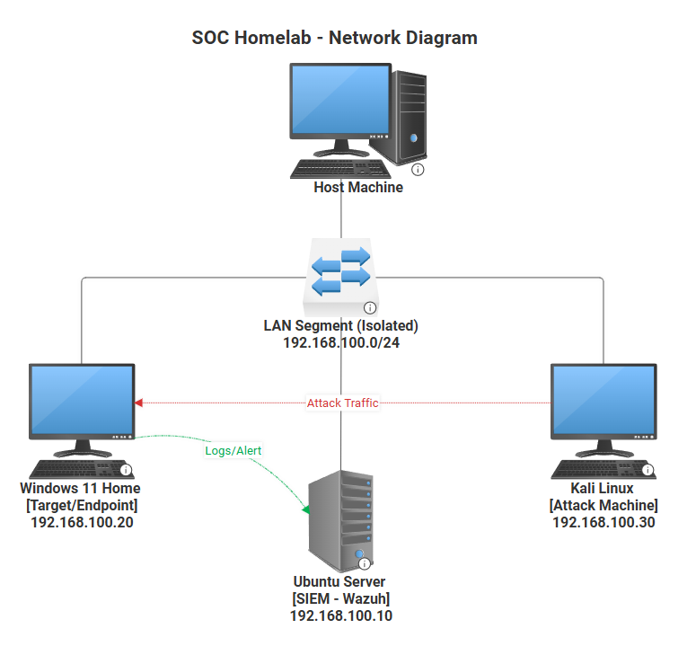

## Network Topology

The lab is built on VMware Workstation using an isolated LAN Segment 
with no internet access, ensuring attack simulations are fully contained.

### Design Decisions

The LAN Segment was chosen over NAT to fully isolate all three VMs from 
the host network, simulating an air-gapped environment. No traffic can 
enter or leave the segment, meaning all attack and defense activity is 
contained within the lab.

### Machine Roles

**Ubuntu Server (192.168.100.10)** acts as the SIEM server running Wazuh, 
collecting logs and generating alerts from monitored endpoints.

**Windows 11 (192.168.100.20)** is the target endpoint simulating a 
workstation in a corporate environment with a standard user and admin account.

**Kali Linux (192.168.100.30)** is the attack machine used to simulate 
threat actor behavior against the Windows endpoint.
