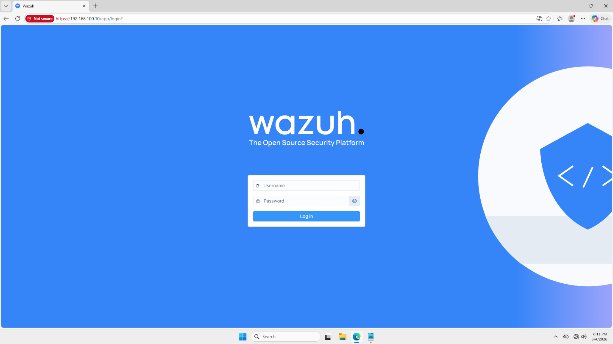
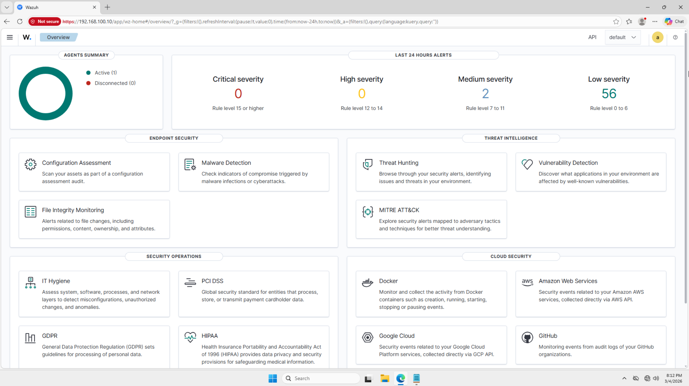
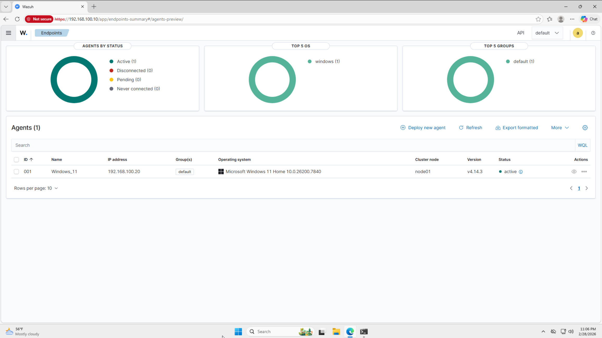

# Wazuh Setup

This document covers the installation and configuration of the Wazuh SIEM stack on Ubuntu Server - SIEM. Wazuh serves as the central security monitoring platform for the SOC homelab, collecting and analyzing security logs from monitored endpoints and generating alerts for suspicious activity.

## Why Wazuh

Wazuh was chosen as the SIEM platform for this lab over alternatives such as Splunk and Elastic SIEM for the following reasons:

**Cost** - Wazuh is free and open-source, with no licensing restrictions. Splunk's free tier is limited in the amount of data you can collect data per day, which is not ideal for a lab generating endpoint telemetry. Elastic stack SIEM requires significant configuration overhead to reach similar capabilities with Wazuh out of the box.

**Enterprise Relevance** - Wazuh is widely deployed in production environments, making it directly relevant to industry standards. Experience with Wazuh incorporates real-world skills and techniques used by industry professionals.

**All-in-One Stack** - Wazuh provides a complete SIEM solution, including log collection, threat detection, alerting, and a dashboard in a single installation. This reduces setup complexity, maintenance overhead, and allows for focus on security operations rather than infrastructure.

**Resource Efficiency** - Wazuh generally runs more efficiently with fewer system resources than Elastic or Splunk, which is a key metric in a homelab where system resources are tightly controlled to ensure all devices can function properly.

**Community and Documentation** - Wazuh has extensive official documentation, an active community, and regular updates, making troubleshooting and learning straightforward.

## Wazuh Stack Components

The full Wazuh stack consists of three components, all installed on Ubuntu Server - SIEM:

| Component | Description |
|---|---|
| Wazuh Manager | Receives and processes security logs from agents, applies detection rules, and generates alerts |
| Wazuh Indexer | Stores and indexes all log data and alert information for search and analysis |
| Wazuh Dashboard | Web-based interface for viewing alerts, agent status, and security events |

## Prerequisites

Before installing Wazuh, ensure Ubuntu Server - SIEM is fully installed, the static IP is configured, and the system packages have been updated. Full details are documented in [Ubuntu Server - SIEM Setup](siem-server-setup.md). Internet access through [pfSense](pfsense-setup.md) is required to download the Wazuh installation script.

## Installation

Wazuh was installed on Ubuntu Server - SIEM using the official Wazuh quickstart installation script, which automates the deployment of all three stack components in a single command. The official quickstart installation guide can be found at the [Wazuh Quickstart Installation Guide](https://documentation.wazuh.com/current/quickstart.html).

Run the following command on Ubuntu Server - SIEM to download and execute the quickstart script:
```bash
curl -sO https://packages.wazuh.com/4.11/wazuh-install.sh && sudo bash ./wazuh-install.sh -a
```

The quickstart script handles all dependency installation, service configuration, and initial setup automatically. After the script completes, all three Wazuh services are running, and the dashboard is accessible via browser.

## Accessing the Dashboard

The Wazuh dashboard is accessible through an internet browser using the Ubuntu Siem Servers IP address as the domain:
```
https://192.168.100.10
```

A self-signed SSL certificate is used by default, which causes the browser to display a security warning on first access. This is expected behavior - proceed by clicking **Advanced > Proceed** to access the dashboard.

### Wazuh Dashboard Login Page



### Wazuh Dashboard Home

The screenshot below shows the Wazuh dashboard home page after successful login, confirming the full stack is operational.



## Verifying Services

After installation, all three Wazuh services were verified as active and running using the following command on Ubuntu Server - SIEM:
```bash
sudo systemctl is-active wazuh-manager.service wazuh-indexer.service wazuh-dashboard.service
```

Expected output:
```
wazuh-manager: active
wazuh-indexer: active
wazuh-dashboard: active
```


## Agent Deployment

After the Wazuh stack was confirmed operational, a Wazuh agent was deployed on the Windows 11 target endpoint through the Wazuh dashboard to begin forwarding security logs to the Wazuh Manager. The screenshot below shows the Windows 11 agent appearing as active in the Wazuh dashboard, confirming successful communication to Wazuh-manager. Full agent installation details are documented in [Wazuh Agent Setup](wazuh-agent-setup.md).



## Starting Wazuh After Reboot

Wazuh services can be enabled to start automatically after booting Ubuntu Server - SIEM with the following commands:
```bash
sudo systemctl enable wazuh-manager
sudo systemctl enable wazuh-indexer
sudo systemctl enable wazuh-dashboard
```

## Configuration Notes

- The Wazuh dashboard uses a self-signed SSL certificate by default - the browser security warning on first access is expected and can be safely bypassed within the lab environment
- Default dashboard credentials should be changed after the first login for security best practice, even within a lab environment
- The Wazuh Manager stores all logs and alert data on the Ubuntu Server - SIEM disk - this is why 80GB storage was allocated to this VM to accommodate data accumulation over time
- Internet access through [pfSense](pfsense-setup.md) is required for the initial installation - ensure pfSense is running before attempting to download the quickstart script
- Full Wazuh documentation is available at [https://documentation.wazuh.com](https://documentation.wazuh.com)
